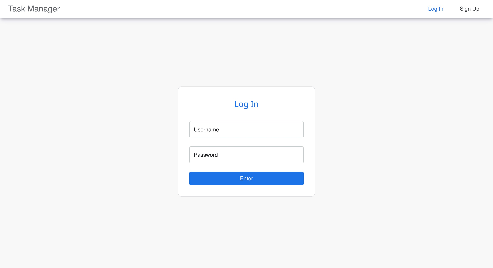
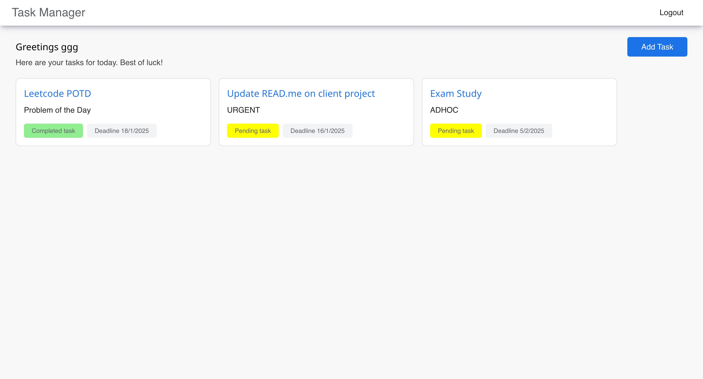
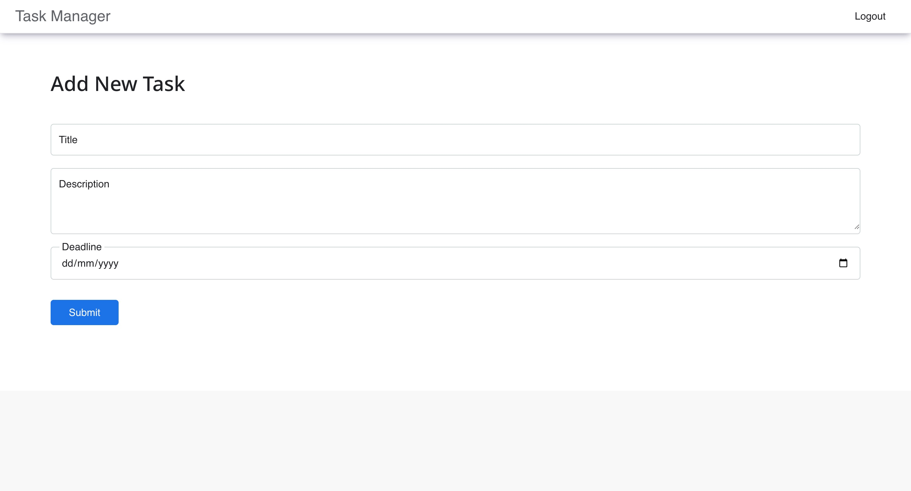

# Task Management Web Application

This repository hosts the **Task Manager Web Application**, a full-stack application for managing tasks with user authentication and authorization. The app enables users to register, log in, and perform CRUD operations on tasks. It is designed with scalability, security, and responsiveness in mind.

## Table of Contents
- [Features](#features)
- [Tech Stack](#tech-stack)
- [Live Demo](#live-demo)
- [Getting Started](#getting-started)
  - [Prerequisites](#prerequisites)
  - [Installation](#installation)
  - [Environment Variables](#environment-variables)
  - [Running the Application](#running-the-application)
- [API Documentation](#api-documentation)
- [Testing](#testing)
- [Code Structure](#code-structure)
- [Security Measures](#security-measures)
- [Screenshots](#screenshots)
- [Demo Video](#demo-video)
- [License](#license)

---

## Features

- **Task Management**: Add, view, update, and delete tasks.
- **User Authentication**: Secure user registration and login with JWT-based authentication and authorization.
- **Responsive Design**: Mobile-friendly interface for seamless usability on all devices.
- **Secure Data Handling**: Password hashing and input validation to prevent vulnerabilities.
- **Error Handling**: Informative error messages for users and robust backend validation.
- **Deployment**: Live application hosted for public access.

---

## Tech Stack

- **Frontend**: React.js, TailwindCSS
- **Backend**: Node.js, Express.js
- **Database**: MongoDB
- **Authentication**: JSON Web Tokens (JWT)
- **Hosting**: Frontend & Backend on Vercel, Database on MongoDB Atlas

---
## Live Demo

Access the live application here: [Task Manager Live Demo](https://tasktracker-blush.vercel.app/)

---

## Getting Started

### Prerequisites
- Node.js (14.17.0 or higher)
- MongoDB (4.4.3 or higher)
- npm (6.14.13 or higher)
- A code editor or IDE of your choice
- A MongoDB Atlas account for database hosting
- A vercel account for hosting

### Installation
To run this application locally, follow these steps:

1. Clone this repository:

   ```bash
   git clone https://github.com/Rollins19-05-2003/tasktracker.git
   ```

2. Install dependencies for the frontend and backend:

   ```bash
   # Install frontend dependencies
   cd client
   npm install 

   # Install backend dependencies
   cd ../server
   npm install
   ```

4. Configure the environment variables for the backend:
   - Create a `.env.development` file in the `server` directory containing
     ```
        PORT=5000
        DATABASE_URL=<Your MongoDB connection string>
        ACCESS_TOKEN_SECRET=<Your JWT access token secret>
        REFRESH_TOKEN_SECRET=<Your JWT refresh token secret>
        FRONTEND_URL=http://localhost:3000
     ```
   - Create a `.env` file in the `client` directory containing
     ```
        REACT_APP_BASE_API_URL=http://localhost:3001
     ```

5. Run the backend and frontend applications:

   ```bash
   # In the backend directory
   npm start 

   # In the frontend directory
   npm start 
   ```

7. The application should now be running. Access it in your web browser at `http://localhost:3000`

---
## API Documentation

To successfully complete this project, I completed the following requirements:

### Backend API

- Create a RESTful API to manage tasks.
- Implement the following endpoints:
  - `GET /tasks`: Fetch all tasks.
  - `GET /tasks/:id`: Fetch a single task by ID.
  - `POST /tasks`: Add a new task.
  - `PUT /tasks/:id`: Update a task by ID.
  - `DELETE /tasks/:id`: Delete a task by ID.
- Use persistent data storage (e.g., a relational database, NoSQL database, or an ORM like SQLAlchemy for Python). I have used MongoDB for this project.
- Include error handling for incorrect route access or invalid data inputs.

### Frontend

- Use a frontend framework or library (e.g., React, Vue, Angular). I have used React for this project.
- Implement the following views/pages:
  - List View: Display all tasks with the ability to delete a task.
  - Details View: Display details of a single task.
  - Add/Edit View: A form to add a new task or edit an existing one.
- Implement responsive design (either using a framework like Bootstrap, Tailwind, or manual CSS).
- Connect the frontend to the backend API to perform CRUD operations.

### Authentication

- Implement a simple user authentication system.
- Users should be able to register, log in, and log out.
- Only logged-in users can create, update, or delete tasks.

## Screenshots
### Login Page


### Task Management Dashboard


### Add Task Form

---

## Demo Video
Watch a 2-minute walkthrough of the application: [Demo Video](https://www.awesomescreenshot.com/video/35439248?key=98822e935a55a25b5bc44d622ae86d08)